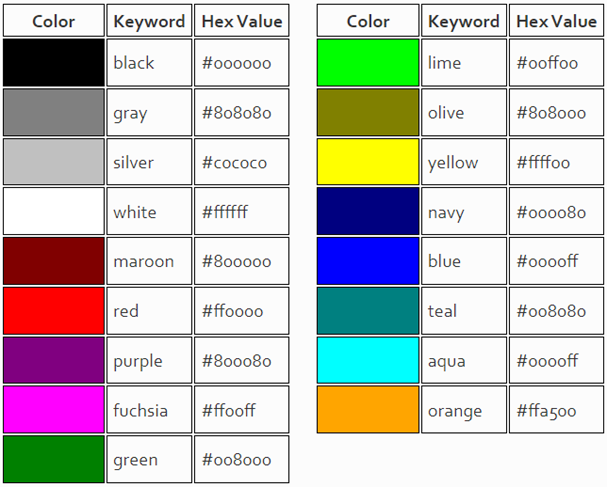

# CSS FUNDAMENTALS

## Applying CSS to HTML

CSS is used to add styles on web pages that contain HTML elements. There are three methods to add styles on web pages, these are – Inline, Internal, and External.

 - **Inline CSS** - is a way of defining the styling of an HTML element by adding CSS rules directly to the element’s tag using the “style” attribute. It is used for quick and simple styling changes to specific elements, without creating a separate CSS file.

```html
<p style="color:red;">This is my red paragraph.</p>
```

- **Internal CSS** - also known as embedded CSS is a method of adding CSS rules directly to the head section of an HTML document. It involves using the `<style>` element to enclose the CSS code within the HTML document itself. Internal CSS is placed within the `<head>` section of the HTML document, typically after the document’s title and before any other content.

```html
 <style>
      p {
        color: red;
      }
    </style>
```

- **External CSS** - is used to place CSS code in a separate file and link to the HTML document. To use external CSS, create a separate file with the .css file extension that contains your CSS rules. You can link this file to your HTML document using the “link” tag in the head section of your HTML document.
In this case, the “link” tag specifies the type of the file (CSS), the relationship between the HTML document and the CSS file (“stylesheet”), and the location of the CSS file (“href” attribute). The href attribute points to the URL or file path of your external CSS file.

```html
 <link rel="stylesheet" href="style.css" />
```

## Conflicts Between Selectors

CSS conflicts between selectors occur when two or more selectors have conflicting styles applied to the same element, leading to unexpected results. In such cases, the browser has to decide which style to apply to the element. 

Causes of Conflicting Styles in CSS: There are several ways that conflicting styles can arise in CSS. One common cause is using multiple stylesheets, either external or internal, that have overlapping or conflicting rules. When styles from multiple stylesheets are applied to the same element, the browser will have to decide which style to use, leading to conflicts.

Another cause of conflicting styles is the use of multiple selectors that apply to the same element. If these selectors have conflicting styles, the browser will have to decide which style to apply, based on the specificity and order of the selectors.

There are three reasons for CSS style conflict:
1. **Specificity**

The more specific selector will override the less specific one. Specificity is calculated based on the number of elements, classes, and IDs in the selector.

For example, the selector with an ID has a higher specificity than the one with a class, and the one with a class has a higher specificity than the one with an element.

```css
/* -------------------------Specificity---------------------------- */
/* An ID selector has a higher specificity than a class selector
A class selector has a higher specificity than an element selector */

#first-country {
    font-size: large;
}

.first-country {
    font-size:  x-large;
}

li {
    font-size:  medium;
}
```


2. **Inheritance**

Inheritance is the process by which styles applied to a parent element are passed down to its child elements.

If two selectors have the same specificity, the one that comes later in the stylesheet will override the earlier one.

If one of the conflicting styles is inherited, the browser will use the inherited style over the non-inherited style, even if the non-inherited style has a higher specificity or is defined later in the cascade order.

```css
/* -------------------------Inheritance---------------------------- */
/* styles applied to a parent element are passed down to its child elements */

/* Style applied to the parent element */
.parent {
    font-size: 14px;
}

/* Conflicting style applied to the child element */
.child {
    font-size: 20px;
}
```

3. **!important**

The styles marked with the !important keyword will always take precedence over any other styles.

```css
/* -------------------------!important---------------------------- */
/* The styles marked with the !important keyword will always take precedence over any other styles. */

#first-country {
    font-size: large;
}

li {
    font-size:  medium !important;
}
```

## CSS styling text

The CSS properties used to style text generally fall into two categories:
 - Font styles: Properties that affect a text's font, e.g., which font gets applied, its size, and whether it's bold, italic, etc.
- Text layout styles: Properties that affect the spacing and other layout features of the text, allowing manipulation of, for example, the space between lines and letters, and how the text is aligned within the content box.

### COLOR
The color property sets the color of the foreground content of the selected elements, which is usually the text, but can also include a couple of other things, such as an underline or overline placed on text using the text-decoration property.

Color can accept any CSS color unit, for example:

```css
strong {
    color: darkcyan;
}
```

### FONT FAMILES
To set a different font for your text, you use the font-family property — this allows you to specify a font (or list of fonts) for the browser to apply to the selected elements. The browser will only apply a font if it is available on the machine the website is being accessed on; if not, it will just use a browser default font.

A simple example looks like so:

```css
* {
    font-family: Arial, Helvetica, sans-serif;
}
```

Speaking of font availability, there are only a certain number of fonts that are generally available across all systems and can therefore be used without much worry. These are the so-called web safe fonts.

Most of the time, as web developers we want to have more specific control over the fonts used to display our text content. The problem is to find a way to know which font is available on the computer used to see our web pages. There is no way to know this in every case, but the web safe fonts are known to be available on nearly all instances of the most used operating systems (Windows, macOS, the most common Linux distributions, Android, and iOS).

### FONT SIZE
Font size (set with the font-size property) can take values measured in most of these units (and others, such as percentages); however, the most common units you'll use to size text are:

 - **px** (pixels): The number of pixels high you want the text to be. This is an absolute unit — it results in the same final computed value for the font on the page in pretty much any situation.
 - **ems**: 1 em is equal to the font size set on the parent element of the current element we are styling (more specifically, the width of a capital letter M contained inside the parent element). This can become tricky to work out if you have a lot of nested elements with different font sizes set, but it is doable, as you'll see below. Why bother? It is quite natural once you get used to it, and you can use em to size everything, not just text. You can have an entire website sized using em, which makes maintenance easy.
 - **rems**: These work just like em, except that 1 rem is equal to the font size set on the root element of the document (i.e. `<html>`), not the parent element. This makes doing the maths to work out your font sizes much easier, although if you want to support really old browsers, you might struggle — rem is not supported in Internet Explorer 8 and below.

The font-size of an element is inherited from that element's parent element. This all starts with the root element of the entire document — `<html>` — the standard font-size of which is set to 16px across browsers. Any paragraph (or another element that doesn't have a different size set by the browser) inside the root element will have a final size of 16px. Other elements may have different default sizes.

## Working with colors
The color CSS property sets the foreground color value of an element's text and text decorations, and sets the currentcolor value. currentcolor may be used as an indirect value on other properties and is the default for other color properties, such as border-color.

The first and easiest way to specify a color is using one of the 17 predefined color keywords. Clearly most of these colors are unsuitable for normal web design. Color keywords are most useful for testing and demonstration purposes



### RGB Color Values
RGB, which stands for red, green, and blue is the color model that monitors use. Since in web design we are primarily concerned with what web pages look like on screens, RGB is the color model we use.

RGB values are specified for each of the key colors (red, green, blue), using a value between 0 and 255 or a percentage value. A higher value means more of that color.

The CSS syntax for using RGB colors is a little different than we have seen before. In the example below, we are making a paragraph black, an h1 white, and an unordered list purple.

```css
p { color: rgb(0, 0, 0);  /* black */ }
h1 { color: rgb(100%, 100%, 100%);  /* white */ }
ul { color: rgb(128, 80, 200);  /* purple */ }
```

### Hexadecimal Color Values
The most common way to specify colors in CSS is to use their hexadecimal (or hex) values. Hex values are actually just a different way to represent RGB values.

Instead of using three numbers between 0 and 255, we use six hexadecimal numbers. Hex numbers can be 0-9 and A-F. Hex values are always prefixed with a # symbol.

Demonstrated here are the same CSS rules as above, except with hex values. If both digits of the red, green and blue values are the same, we may use the short three-digit notation. 

```css
p { color: #000000;  /* black */ }
h1 { color: #ffffff;  /* white */ }
ul { color: #8050c8;  /* purple */ }

p { color: #f00;  /* red: same as #ff0000 */ }
h1 { color: #0f0;  /* lime: same as #00ff00 */ }
ul { color: #ff0;  /* yellow: same as #ffff00*/ }
```
## Chrome DevTools

There are nine tabs at the top of the Developer Tools window:
- Elements – shows you the HTML used to build the page you’re looking at, together with any inline CSS;
- Console – it gives you information about interactive elements on a page. In Console, you can write JavaScript to interact with the web page you are viewing, and it also lets you write messages to yourself in the JavaScript of websites you’re building, which then show up in Console to show that the JS was executed;
- Source – shows you where all the files that were used to make the website are stored and lets you inspect them;
- Network – shows you all the files that are loading in the URL you are looking at;
- Application – shows you what is in your browser storage: in-browser databases like Web SQL, local storage, and more. It also gives you granular control over your cookies;
- Security – gives you basic security information, letting you view a site’s HTTPS certificate and TLS status;
- Memory
- Performance
- Audits – autogenerates reports on site functionality and structure to help developers improve performance;

They do not always stay in this order – Chrome moves them around based on which you opened last. By default, Developer Tools opens with the Elements tab open.

5 common uses of Chrome Developer Tools:
- Inspect page tags
- Edit CSS
- See what they built the website with
- Write into the website
- See it on mobile

## CSS Flexbox Layout

The flexible box layout module, usually referred to as flexbox, was designed as a one-dimensional layout model, and as a method that could offer space distribution between items in an interface and powerful alignment capabilities.

When we describe flexbox as being one dimensional, we are describing the fact that flexbox deals with layout in one dimension at a time — either as a row or as a column. This can be contrasted with the two-dimensional model of CSS Grid Layout, which controls columns and rows together.

### Properties for the Parent (flex container)

- DISPLAY

This defines a flex container; inline or block depending on the given value. It enables a flex context for all its direct children.

```css
.container {
  display: flex; /* or inline-flex */
}
```

- FLEX-DIRECTION

This establishes the main-axis, thus defining the direction flex items are placed in the flex container. Flexbox is (aside from optional wrapping) a single-direction layout concept. Think of flex items as primarily laying out either in horizontal rows or vertical columns.
1. **row (default)**: left to right in ltr; right to left in rtl
2. **row-reverse**: right to left in ltr; left to right in rtl
3. **column**: same as row but top to bottom
4. **column-reverse**: same as row-reverse but bottom to top


```css
.container {
  flex-direction: row | row-reverse | column | column-reverse;
}
```

- FLEX-WRAP
By default, flex items will all try to fit onto one line. You can change that and allow the items to wrap as needed with this property.
1. **nowrap (default)**: all flex items will be on one line
2. **wrap**: flex items will wrap onto multiple lines, from top to bottom.
3. **wrap-reverse**: flex items will wrap onto multiple lines from bottom to top.

```css
.container {
  flex-wrap: nowrap | wrap | wrap-reverse;
}
```

- JUSTIFU-CONTENT
This defines the alignment along the main axis. It helps distribute extra free space leftover when either all the flex items on a line are inflexible, or are flexible but have reached their maximum size. It also exerts some control over the alignment of items when they overflow the line.
1. **flex-start (default)**: items are packed toward the start of the flex-direction.
2. **flex-end**: items are packed toward the end of the flex-direction.
3. **start**: items are packed toward the start of the writing-mode direction.
4. **end**: items are packed toward the end of the writing-mode direction.
5. **left**: items are packed toward left edge of the container, unless that doesn’t make sense with the flex-direction, then it behaves like start.
6. **right**: items are packed toward right edge of the container, unless that doesn’t make sense with the flex-direction, then it behaves like end.
7. **center**: items are centered along the line
8. **space-between**: items are evenly distributed in the line; first item is on the start line, last item on the end line
9. **space-around**: items are evenly distributed in the line with equal space around them. Note that visually the spaces aren’t equal, since all the items have equal space on both sides. The first item will have one unit of space against the container edge, but two units of space between the next item because that next item has its own spacing that applies.
10. **space-evenly**: items are distributed so that the spacing between any two items (and the space to the edges) is equal.

```css
.container {
  align-items: stretch | flex-start | flex-end | center | baseline | first baseline | last baseline | start | end | self-start | self-end + ... safe | unsafe;
}
```

- ALIGN-ITEMS
This defines the default behavior for how flex items are laid out along the cross axis on the current line. Think of it as the justify-content version for the cross-axis (perpendicular to the main-axis).
 - **stretch (default)**: stretch to fill the container (still respect min-width/max-width)
 - **flex-start / start / self-start**: items are placed at the start of the cross axis. The difference between these is subtle, and is about respecting the flex-direction rules or the writing-mode rules.
- **flex-end / end / self-end**: items are placed at the end of the cross axis. The difference again is subtle and is about respecting flex-direction rules vs. writing-mode rules.
- **center**: items are centered in the cross-axis
- **baseline**: items are aligned such as their baselines align

```css
.container {
  align-items: stretch | flex-start | flex-end | center | baseline | first baseline | last baseline | start | end | self-start | self-end + ... safe | unsafe;
}
```

## CSS Grid Layout

The layout consists of a navigation area (nav), a main content area (main), and three sections (section).

### Files

There is one HTML file (index.html) and one CSS file (styles.css).

### HTML Structure

In `index.html`, we have a `div` with the class container. Inside the container, we define our `nav`, `main`, and `section` elements, each with their respective classes.

```html
    <div class="container">
        <nav class="item-nav">Nav</nav>
        <main class="item-main">Main</main>
        <section class="item-section1">Section 1</section>
        <section class="item-section2">Section 2</section>
        <section class="item-section3">Section 3</section>
    </div>
```

### CSS Styling

In `styles.css`, we style our layout using CSS Grid.

### Grid Container

First, we define our `.container` as a grid using `display: grid`.

```css
.container {
  display: grid;
  grid-template-columns: 1fr 2fr;
  grid-template-rows: auto;
  gap: 10px;
  grid-template-areas:
    "nav main main"
    "nav section1 section1"
    "nav section2 section2"
    "nav section3 section3";
}
```

Here, `grid-template-columns` and `grid-template-row`s set the layout in terms of columns and rows. `1fr` and `2fr` are fractional units, representing proportions of the available space. `grid-template-areas` defines the layout using named grid areas.

### Grid Items

Then, we assign the areas to the respective grid items:

```css
.item-nav {
  grid-area: nav;
}

.item-main {
  grid-area: main;
}

.item-section1 {
  grid-area: section1;
}

.item-section2 {
  grid-area: section2;
}

.item-section3 {
  grid-area: section3;
}
```

### Responsive 

To make eveything response, that's where CSS Grid shines the most, you just add a media query on the container and you can change the template-areas.

```css
@media (max-width: 750px) {
  .container {
    grid-template-columns: 1fr;
    grid-template-areas:
      "nav"
      "main"
      "section1"
      "section2"
      "section3";
  }

```

### Conclusion

This is a basic demonstration of creating a responsive layout using CSS Grid. CSS Grid allows for complex and flexible layouts with fewer lines of code and more intuitive styling syntax.I will say that is up to you if you want to continue with flexbox, or grid, or combine them both. 
